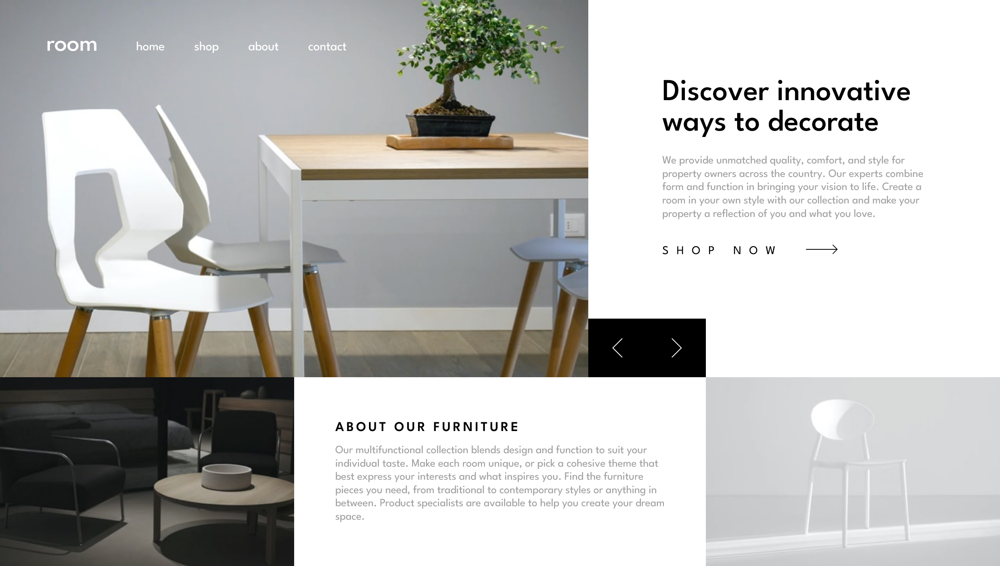

# Frontend Mentor - Room homepage solution

This is a solution to the [Room homepage challenge on Frontend Mentor](https://www.frontendmentor.io/challenges/room-homepage-BtdBY_ENq). Frontend Mentor challenges inspire me to build more realistic projects. 

## Overview

### The challenge

Users should be able to:

- View the optimal layout for the site depending on their device's screen size
- See hover states for all interactive elements on the page
- Navigate the slider using either their mouse/trackpad or keyboard

### Screenshot

### Links

- Live Site URL: [Add live site URL here](https://clemensrosenow.github.io/room-homepage/)

### Built with

- Semantic HTML5 markup
- Flexbox & CSS Grid
- Scroll-Snapping
- Slide & Hover Transitions
- Desktop-first workflow

### What I learned

After starting this project over one year ago, I learned how to simplify the CSS and make it more robust. Scroll-Snapping and Slide animations triggered by JavaScript help giving the site an aesthetic feel.
